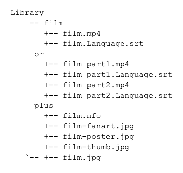

# Kodi Film Library Maintainer

> Highly-automated TUI for maintaining an ideal film library

- Renames and deletes files as necessary to create ideal file structure

- Retrieves missing metadata and creates Kodi NFO files

- Downloads missing subtitles for films not in chosen language

- Assumes top-level directories contain a single film

- Croatian, Czech, Dutch, English, French, Greek, Hungarian, Italian, Polish, Portuguese, Portuguese (Brazilian), Romanian, Serbian, Spanish and Turkish subtitles supported

## Ideal File Structure



## Installation

```sh
git clone https://github.com/adam1one/film-library.git
cd film-library
npm install
```
## Usage

```sh
node app.js
```

## Notes
- Requires [TMDB API key](https://developers.themoviedb.org/3), [OMDB API key](http://www.omdbapi.com/) and [opensubtitles.org](https://www.opensubtitles.org/) credentials
- Review tasks carefully as deleted files cannot be recovered!

## Troubleshooting
#### 404 error when downloading subtitles:

Opensubtitles.org daily quota reached, wait 24 hours.
	
#### Film was wrongly identified: 

Create a [Kodi NFO](https://kodi.wiki/view/NFO_files/Movies) file containing a `<uniqueid type="imdb">` or `<uniqueid type="tmdb">` node.

#### Metadata/subtitle search results are out of date:

Delete relevant files in `./cache` directory.

####  I don't want to rename/delete a particular file/directory:

Add path to `.ignored_paths` in the film library base directory.
  

## Licence

Distributed under the GNU General Public Licence. See ``COPYING`` for more information.

## Contributing

- Wrote this for myself and decided to share it
- There is plenty of scope for new features and improvements
- Perhaps someone will find it useful